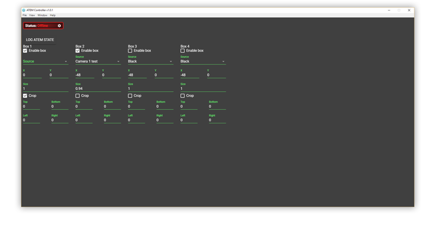

# ATEM Controller

> See and configure the mute status of all your Behringer X32's channels (on every mixbus) in one place.

## Motivation
ATEMs are powerful vision mixers. However, some of that power is hamstrung by an at-times awkward UI.

Specifically, the UI for SuperSources is not very operator-friendly. This program aims to be an alternative UI which smooths out some of the rough edges present in the official first-party ATEM Software Control interface.

## Features
- Right now, not much. Work in progress.

## Planned Features
- Configure Super Source boxes with pixel values.
- Configure Super Source boxes with top-left anchoring, instead of center anchoring.
- Configure Upstream and Downstream keys with pixel values.
- Configure Upstream and Downstream keys with top-left anchoring, instead of center anchoring.

## Installation
Check the [Releases](https://github.com/tipofthehats/atem-controller/releases) page to grab the latest installer for your operating system.
Once installed, the application will autoupdate.

## Credits
Developed by [Alex Van Camp](https://twitter.com/vancamp)  
Assets and additional design by [Chris Hanel](https://twitter.com/chrishanel)  

## License
ATEM Controller is provided under the MIT license, which is available to read in the 
[LICENSE](https://github.com/tipofthehats/atem-controller/blob/master/LICENSE) file.
