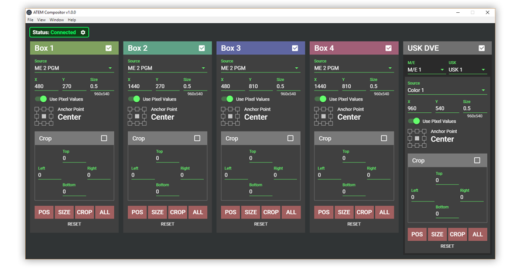

# ATEM Compositor

> An alternate UI for rapidly creating precise compositions on a Blackmagic ATEM video switcher.

## Motivation
ATEMs are powerful vision mixers. However, some of that power is hamstrung by an at-times awkward UI.

Specifically, the UI for SuperSources is not very operator-friendly. This program aims to be an alternative UI which smooths out some of the rough edges present in the official first-party ATEM Software Control interface.

## Features
- All SuperSource box features of the stock UI.
- Configure the X and Y position of SuperSource boxes using pixel values.
- Size and position SuperSource boxes using one of 9 anchor points, instead of only being limited to a center anchor point. 
- Use a USK DVE as a sort of fifth SuperSource box

## Planned Features
- Configure all Upstream and Downstream keys with pixel values.
- Configure all Upstream and Downstream keys with top-left anchoring, instead of center anchoring.

## Installation
Check the [Releases](https://github.com/tipofthehats/atem-compositor/releases) page to grab the latest installer for your operating system.
Once installed, the application will autoupdate.

## Credits
- Developed by [Alex Van Camp](https://twitter.com/vancamp)
- Assets and additional design by [Chris Hanel](https://twitter.com/chrishanel)
- Feedback and support from [SuperFly.tv](http://superfly.tv/)

## License
ATEM Compositor is provided under the MIT license, which is available to read in the 
[LICENSE](https://github.com/tipofthehats/atem-compositor/blob/master/LICENSE) file.
